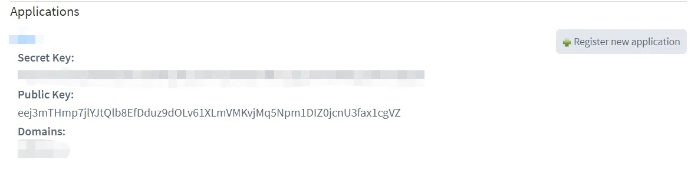

# DisqusJS

A fast and light Disqus Comment plugin for WordPress

# Plugin Configuration

1. `Disqus Shortname`: this is identifier for DisqusJs to load your site, you will have a shortname when create site on [https://disqus.com/admin/create/](https://disqus.com/admin/create/)
   
2. `Disqus API Key`: this create DisqusJs's access to Disqus API, you can create one from: [https://disqus.com/api/applications/register/](https://disqus.com/api/applications/register/)
   
3. `Disqus API Endpoint`: This option is for some users who cannot access Disqus directly, those users would use this endpoint to access Disqus' data. By default it is `https://disqus.edlinus.cn/api/`, you can change it to `https://disqus.skk.moe/disqus/` if disqus don't load properly
4. `Disqus Max Comment Nesting Level` : This option's default value is 4, if you want to see a more nested comment, you can change this value to bigger one
5. `Disqus Admin User Name`: Your site's disqus admin user's name, you can find it on [Disqus – Settings – Account – Username](https://disqus.com/home/settings/account/)
6. `Disqus Admin Badge Name`: A badge would be displayed on comment list if a user is your site's disqus admin, this value should be consistent with [Disqus Admin – Settings – Community – Moderator Badge Text](https://disqus.com/admin/settings/community/)

# Demo

[https://edlinus.cn](https://edlinus.cn)

# Credit

1. [Disqus.js](https://github.com/SukkaW/DisqusJS) from [Sukka](https://disqus.skk.moe)
2. [pipDisqus](https://wordpress.org/plugins/pipdisqus/) from [pipdig](https://www.pipdig.co/)
